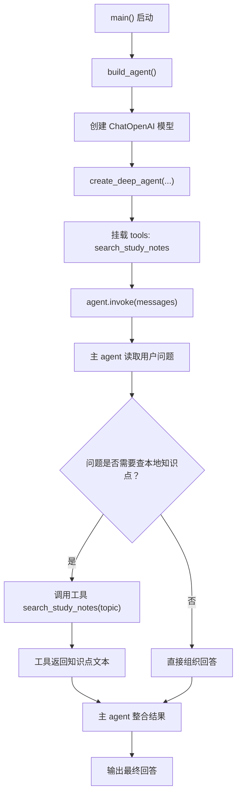
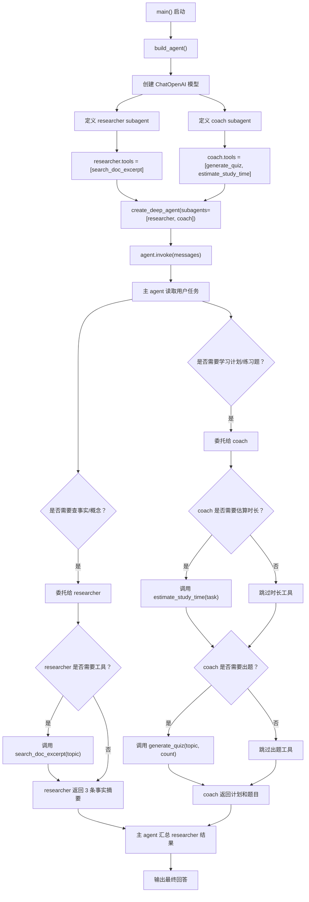
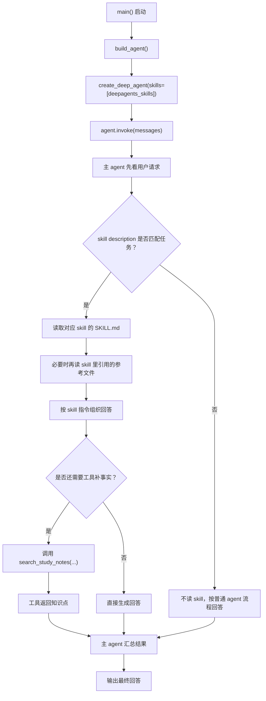
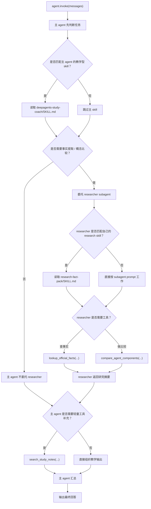
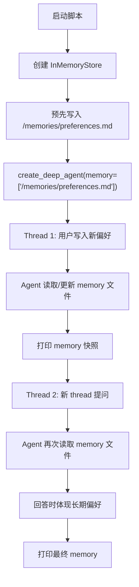
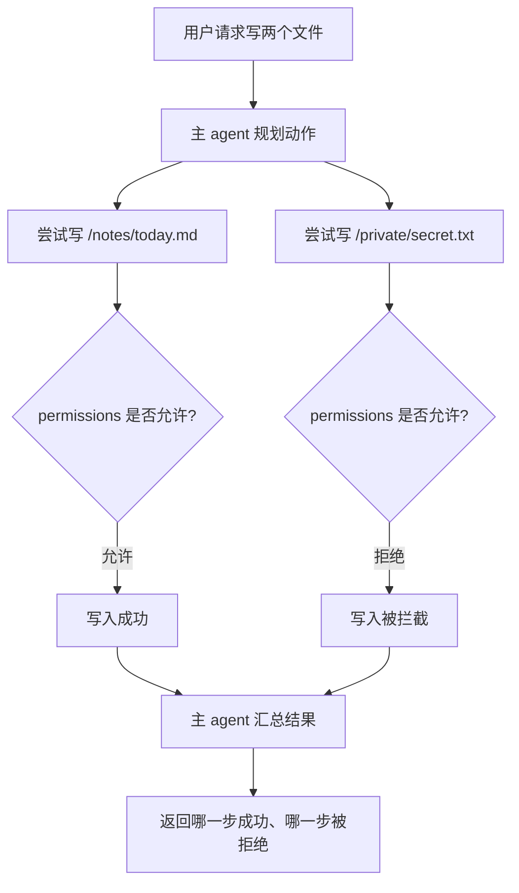
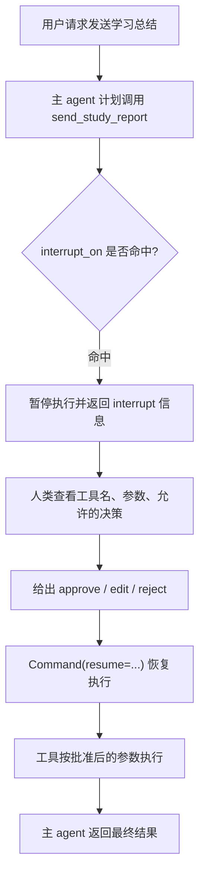
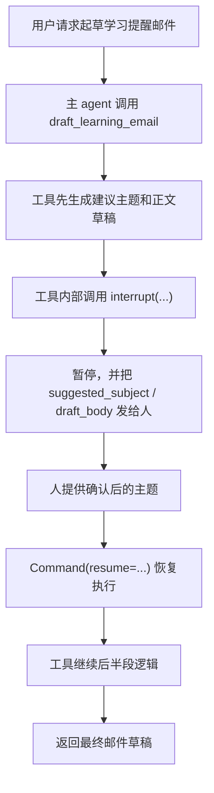

# Deep Agents Demo 调用流程图

这份文档专门解释两个 demo 的执行路径，重点看：

- 主 agent 什么时候开始工作
- 什么情况下会触发 subagent
- subagent 什么时候会调用自己的工具
- 哪些调用是固定的，哪些调用是模型自主决定的

## 先记一个总原则

在 Deep Agents 里：

- `agent.invoke(...)` 一调用，主 agent 就开始执行
- 是否触发 `subagent`，不是你在 Python 代码里手写 `if/else` 决定的
- 而是模型根据：
  - 用户任务
  - `system_prompt`
  - subagent 的 `description`
  - subagent 挂载的 `tools`
  来自主判断

所以你看到的“是否调用 researcher / coach”，本质上是 agent 在运行时做的决策。

---

## Demo 01：只有主 agent，没有 subagent

对应文件：
[demo_01_basic.py](/Users/liangzhe/workspace/codex/deep-agents-t1/deepagents_demo/demo_01_basic.py)

### Mermaid 图



### ASCII 图

```text
main()
  |
  v
build_agent()
  |
  +--> ChatOpenAI(...)
  |
  +--> create_deep_agent(
         tools=[search_study_notes]
       )
  |
  v
agent.invoke(...)
  |
  v
[主 agent]
  |
  +--> 判断：要不要查工具？
         |
         +--> 如果要
         |     |
         |     +--> search_study_notes(...)
         |     |
         |     +--> 返回知识点文本
         |
         +--> 如果不要
               |
               +--> 直接生成回答
  |
  v
最终输出
```

### 这个 demo 的关键观察点

- 这里只有一个主 agent
- 工具 `search_study_notes` 直接挂在主 agent 身上
- 主 agent 既负责判断，也负责调用工具，也负责最后回答
- 这里不会触发 subagent

---

## Demo 02：主 agent + 2 个 subagent

对应文件：
[demo_02_subagents.py](/Users/liangzhe/workspace/codex/deep-agents-t1/deepagents_demo/demo_02_subagents.py)

### 角色分工

- 主 agent：负责整体协调和最终汇总
- `researcher` subagent：负责查概念和事实
- `coach` subagent：负责练习题和学习计划

### Mermaid 图



### ASCII 图

```text
main()
  |
  v
build_agent()
  |
  +--> ChatOpenAI(...)
  |
  +--> 定义 researcher
  |      |
  |      +--> description:
  |      |    "Researches Deep Agents concepts..."
  |      |
  |      +--> tools:
  |           [search_doc_excerpt]
  |
  +--> 定义 coach
  |      |
  |      +--> description:
  |      |    "Designs practice exercises..."
  |      |
  |      +--> tools:
  |           [generate_quiz, estimate_study_time]
  |
  +--> create_deep_agent(
         subagents=[researcher, coach]
       )
  |
  v
agent.invoke(...)
  |
  v
[主 agent]
  |
  +--> 先理解用户任务
  |
  +--> 如果发现“要查概念 / 事实”
  |      |
  |      +--> 调 researcher
  |             |
  |             +--> researcher 视情况调用
  |                    search_doc_excerpt(...)
  |             |
  |             +--> researcher 返回摘要
  |
  +--> 如果发现“要学习计划 / 练习题”
         |
         +--> 调 coach
                |
                +--> coach 视情况调用
                |    estimate_study_time(...)
                |
                +--> coach 视情况调用
                |    generate_quiz(...)
                |
                +--> coach 返回计划和题目
  |
  v
[主 agent 汇总]
  |
  v
最终输出
```

---

## 什么时候触发 subagent

最直观的判断方式是看“主 agent 是否觉得某个 subagent 的 description 很匹配当前子任务”。

在这个 demo 里，大概率会这样触发：

- 用户要“非常短的概念解释”
  - 主 agent 可能触发 `researcher`
- 用户要“3 天学习计划”
  - 主 agent 可能触发 `coach`
- 用户要“3 道检验题”
  - 主 agent 很可能触发 `coach`

注意，这里是“可能”而不是“绝对”，因为 agent 运行不是硬编码流程，而是模型决策流程。

---

## 什么时候调用工具

subagent 被触发后，也不是一定会立刻调用工具。

它通常会先判断：

- 仅靠自己已有上下文能不能回答
- 有没有必要调用工具拿更具体的信息

在这个 demo 里，常见情况是：

- `researcher`
  - 常见会调用：`search_doc_excerpt(...)`
- `coach`
  - 常见会调用：`estimate_study_time(...)`
  - 常见会调用：`generate_quiz(...)`

但如果模型觉得某部分信息已经足够，也可能少调一个工具。

---

## 一张最重要的心智图

```text
用户请求
  |
  v
主 agent
  |
  +--> 判断这个子任务像不像 researcher 的活
  |      |
  |      +--> 像：委托 researcher
  |
  +--> 判断这个子任务像不像 coach 的活
         |
         +--> 像：委托 coach

researcher / coach 被委托之后
  |
  +--> 再各自决定要不要用自己手里的工具
  |
  +--> 把结果返回给主 agent

主 agent
  |
  +--> 做最终汇总
  |
  v
输出给用户
```

---

## 你现在最该观察的东西

如果你是为了真正看懂 Deep Agents，不要只盯着“有没有返回结果”，而要盯这 3 件事：

1. 主 agent 手里有什么能力
2. subagent 的 `description` 如何影响分工
3. 工具是挂在主 agent 还是挂在 subagent 身上

这三件事决定了整个 agent graph 的执行形态。

---

## 一句结论

`demo_02` 里最关键的不是“有两个 subagent”，而是：

- 主 agent 不再亲自做所有事
- 它先判断任务类型
- 再把合适的部分委托给合适的 subagent
- subagent 再决定要不要调用自己的工具

这就是 Deep Agents 里“delegation + context isolation”的最小工作模型。

---

## Demo 03：主 agent + skills

对应文件：
[demo_03_skills.py](/Users/liangzhe/workspace/codex/deep-agents-t1/deepagents_demo/demo_03_skills.py)

对应 skill：
[deepagents-study-coach/SKILL.md](/Users/liangzhe/workspace/codex/deep-agents-t1/deepagents_skills/deepagents-study-coach/SKILL.md)

### Mermaid 图



### 这个 demo 的关键观察点

- skill 不是一个函数调用
- 主 agent 不会一开始就把整个 skill 全读完
- 它会先做“匹配”
- 只有匹配到 skill 后，才继续读 `SKILL.md`
- 如果 `SKILL.md` 还引用了别的参考文件，agent 才可能继续读取

这就是官方文档里说的 `progressive disclosure`。

---

## Demo 04：tools + skills + subagent 组合

对应文件：
[demo_04_composition.py](/Users/liangzhe/workspace/codex/deep-agents-t1/deepagents_demo/demo_04_composition.py)

主 agent skill：
[deepagents-study-coach/SKILL.md](/Users/liangzhe/workspace/codex/deep-agents-t1/deepagents_skills/deepagents-study-coach/SKILL.md)

researcher subagent skill：
[research-fact-pack/SKILL.md](/Users/liangzhe/workspace/codex/deep-agents-t1/deepagents_subagent_skills/research-fact-pack/SKILL.md)

### Mermaid 图



### 这个 demo 最关键的学习点

- `tool` 解决“能力调用”
- `skill` 解决“处理套路”
- `subagent` 解决“执行分工和上下文隔离”

以及一个官方文档里很关键的边界：

- 主 agent 的 skill 不会自动给自定义 subagent
- 自定义 subagent 如果也要 skill，必须显式配置 `skills=[...]`

---

## Demo 05：long-term memory

对应文件：
[demo_05_memory.py](/Users/liangzhe/workspace/codex/deep-agents-t1/deepagents_demo/demo_05_memory.py)

### 这个 demo 在看什么

它不是看“同一个对话上下文还能不能记住”，而是看：

- Thread 1 里学到的偏好
- 到了 Thread 2 还能不能继续生效

如果能，就说明这是 long-term memory，而不是普通对话历史。

### Mermaid 图



### 这个 demo 的关键观察点

- 短期记忆：依赖同一个 thread 的对话历史
- 长期记忆：依赖 memory 文件 + backend/store
- thread 变了，长期记忆仍然可以生效

---

## Demo 06：permissions

对应文件：
[demo_06_permissions.py](/Users/liangzhe/workspace/codex/deep-agents-t1/deepagents_demo/demo_06_permissions.py)

### 这个 demo 在看什么

它要说明的是：

- agent 看起来有文件系统工具
- 但不代表它对所有路径都有权限
- `permissions` 可以按路径和操作类型限制读写

### Mermaid 图



### 这个 demo 的关键观察点

- `permissions` 不是 prompt 建议，而是实际执行限制
- 规则既可以 `allow`，也可以 `deny`
- 限制维度包括：
  - 操作类型：`read` / `write`
  - 路径模式：如 `/notes/**`

---

## Demo 07：interrupt_on

对应文件：
[demo_07_interrupt_on.py](/Users/liangzhe/workspace/codex/deep-agents-t1/deepagents_demo/demo_07_interrupt_on.py)

### 这个 demo 在看什么

它要说明的是：

- `permissions` 是“直接允许/拒绝”
- `interrupt_on` 是“先暂停，等人工批准，再继续”

### Mermaid 图



### 这个 demo 的关键观察点

- `interrupt_on` 不会像 `permissions` 那样直接报拒绝
- 它会先暂停
- 恢复执行时必须复用同一个 `thread_id`
- 如果允许 `edit`，人类可以改参数后再继续

---

## Demo 08：interrupt() 原语

对应文件：
[demo_08_interrupt_primitive.py](/Users/liangzhe/workspace/codex/deep-agents-t1/deepagents_demo/demo_08_interrupt_primitive.py)

### 这个 demo 在看什么

它和 `demo_07` 的区别是：

- `demo_07`：工具调用前被统一拦截
- `demo_08`：工具已经开始执行，执行到中间某一步时主动暂停

### Mermaid 图



### 这个 demo 的关键观察点

- `interrupt_on` 更适合“工具调用前审批”
- `interrupt()` 更适合“工具执行中途暂停”
- 这里的人类输入不是 `approve/edit/reject` 三选一
- 而是直接把中间参数值回填给工具
